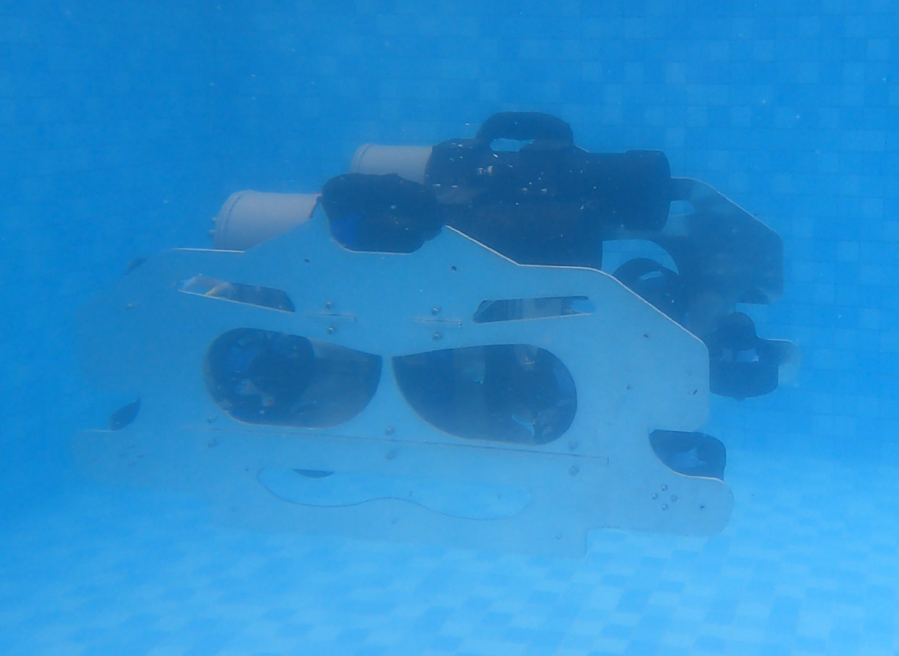

# Stability-Motion-AUV-
<h1 align="center">
  
   
  Program Stability Motion Control AUV
</h1>

<h3 align="center">Berbasis Sensor Inersial dan Estimasi Kedalaman Adaptif</h3>

  🚀 Menjaga kestabilan navigasi AUV dengan algoritma PID yang cerdas dan sensor yang adaptif 
  🤖 Solusi presisi untuk pengendalian gerak bawah laut yang efisien dan responsif

---

## 🧠 Deskripsi Singkat

Sistem ini dirancang untuk menjaga **kestabilan gerakan Autonomous Underwater Vehicle (AUV)** menggunakan algoritma **PID** yang disesuaikan berdasarkan pembacaan dari:

- **Sensor Inersial (IMU BNO055)** untuk arah hadap (heading, pitch, roll)
- **Sensor Tekanan** untuk estimasi kedalaman secara real-time

✨ Dengan dukungan struktur kontrol yang modular, sistem ini dapat **diintegrasikan ke dalam kontrol otomatis penuh**, mendukung mode autonomous dalam skenario navigasi kompleks di bawah air.

---

## ⚙️ Fitur Utama

- ✅ Pengendalian gerak AUV berbasis PID 
- ✅ Integrasi sensor IMU dan tekanan untuk kontrol posisi yang stabil
- ✅ Estimasi kedalaman adaptif sesuai perubahan lingkungan

---
## 🎯 Tujuan Pengembangan

Sistem ini dibangun untuk menjawab kebutuhan akan **kendali gerakan bawah laut yang presisi dan stabil**, dalam berbagai kondisi operasional seperti:

- Penelitian lingkungan laut
- Robotika eksplorasi bawah air
- AUV edukatif dan kompetisi

---

## 🤝 Kontributor

- Ryan Satria Wijaya
- Dhaniel Beny Wardhana
- Wildan Mahfudh Khoirul Murtadho
- Aditia Ummardiansyah
- Aldi Ali Yudianto
- Adifta Justiano
- Krisna Dwi Cahya
- Rendy Androleo Rizaldy
- Rizki Agustino
- Argiansyah Sastryo
- Annisa Nur Azizah

